# Dictionary App

Đây là project phục vụ cho môn học Lập trình hướng đối tượng.

## Contributors
21021441 - Lê Toàn Thắng\
21020145 - Phạm Tường Minh

## Giao diện cơ bản của từ điển
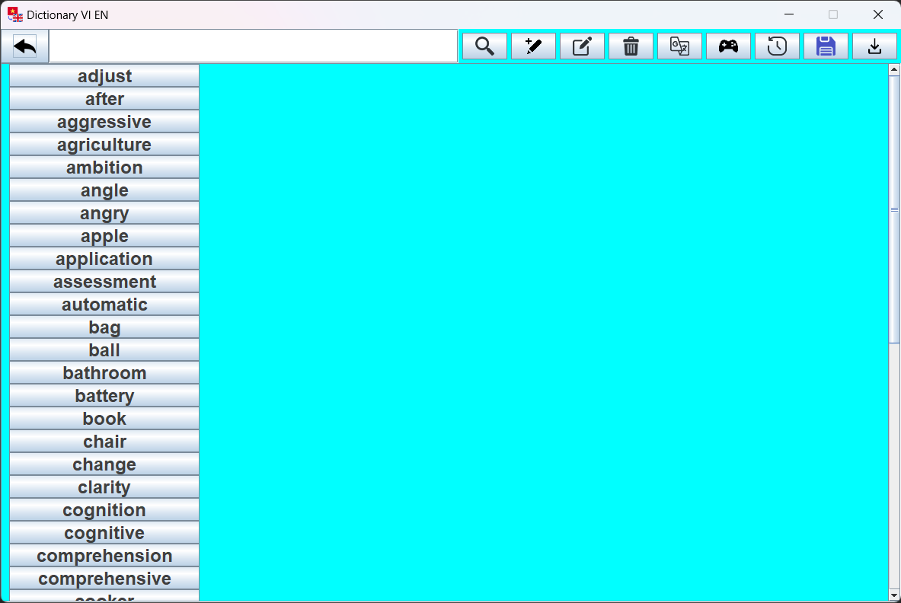\
Từ điển có các chức năng như nhập file, xuất file, thêm từ,...

## Hiển thị nghĩa của từ
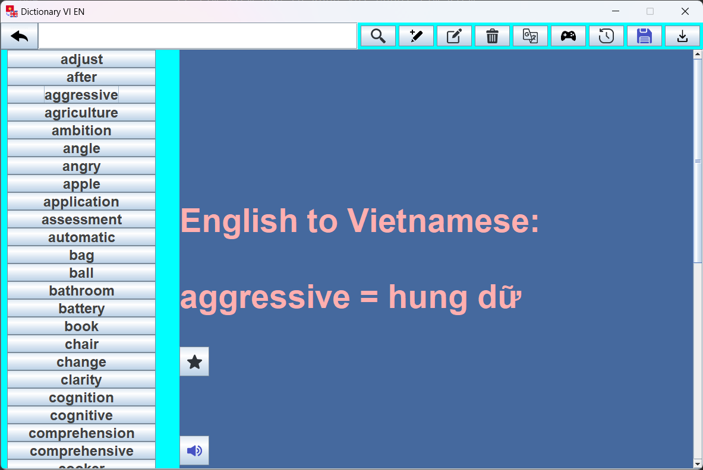
Ngay dưới nghĩa của từ sẽ có nút "Favourite" và nút "Voice"
+ Nút Favourite để lưu lại những từ yêu thích và những từ được yêu thích sẽ được đánh dấu 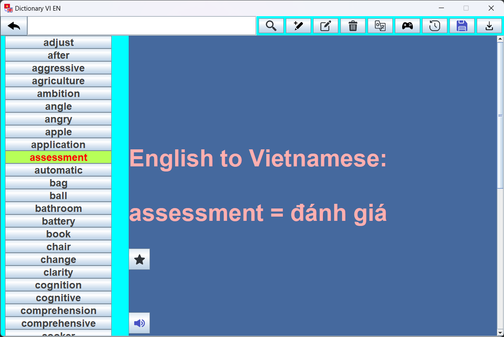
+ Nút Voice sẽ giúp phát âm từ Tiếng Anh.

## Các chức năng
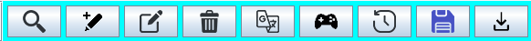\
Trên đây là hình ảnh tất cả các chức năng của từ điển.
### Search
\
Đây là nút cho phép người dùng tìm kiếm từ theo cú pháp.\
Sau khi nhấn vào nút, các từ có cú pháp tương đồng sẽ xuất hiện.\
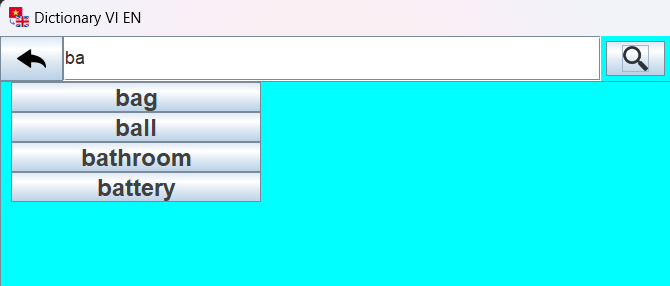

### Add
\
Đây là nút cho phép người dùng thêm 1 từ tiếng anh và nghĩa của nó vào từ điển.\
Sau khi nhấn vào nút, cửa sổ này sẽ hiện ra cho phép người dùng thao tác.\
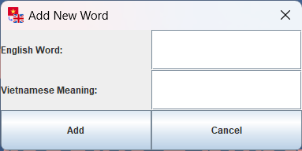

### Edit
\
Đây là nút cho phép người dùng sửa đổi 1 từ trong từ điển tùy ý.\
Sau khi nhấn vào nút, cửa sổ này sẽ hiện ra cho phép người dùng thao tác.\
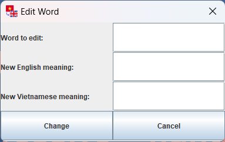

### Remove
\
Đây là nút cho phép người dùng xóa 1 từ trong từ điển tùy ý.\
Sau khi nhấn vào nút, cửa sổ này sẽ hiện ra cho phép người dùng thao tác.\
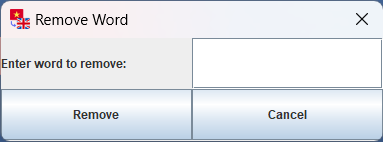

### Translate
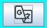\
Đây là nút cho phép người dùng thực hiện dịch một từ trong một cửa sổ tương đồng với Google Translate.\
Sau khi nhấn vào nút, cửa sổ này sẽ hiện ra cho phép người dùng thao tác.\
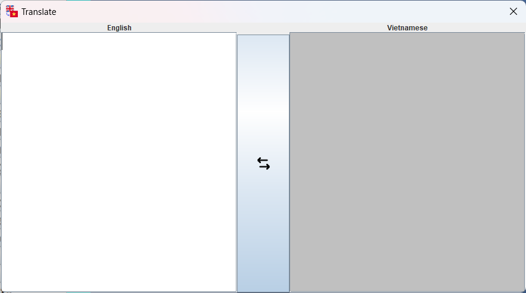\
Cửa sổ này có nút "Swap" ở giữa màn hình để người dùng có thể linh hoạt chuyển đổi giữa dịch Việt-Anh và Anh-Việt.

### History, Import File, Export File
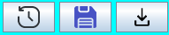\
3 nút trên lần lượt là "History", "Import File", "Export File"
+ Nút "History" sẽ hiện ra tất cả các từ đã click vào xem nghĩa.
+ Nút "Import File" sẽ cho người dùng chọn một file text bất kì trên máy tính để import vào từ điển.
+ Nút "Export File" sẽ giúp người dùng xuất ra một file text với tên và đường dẫn tự chọn, file text này bao gồm tất cả các từ trong từ điển và nghĩa của nó, ngăn cách nhau bởi dấu "tab".
  
## Game
\
Đây là nút cho phép người dùng chơi game đoán từ.\
Sau khi nhấn vào nút, giao diện bắt đầu sẽ hiện lên\
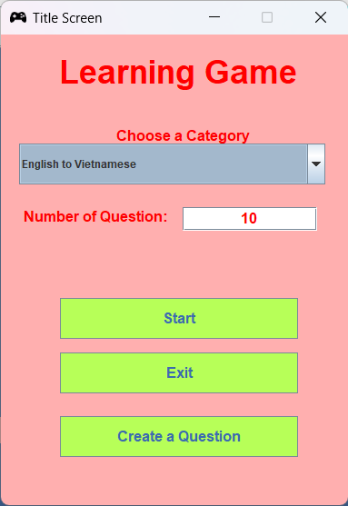\
Người dùng có thể chọn loại câu ở mục "Choose a category" và số lượng câu hỏi ở mục "Number of question".\
Sau khi nhấn vào nút "Start", giao diện câu hỏi sẽ hiện lên.\
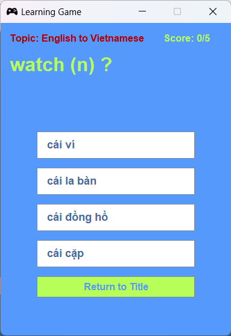\
Người dùng có thể sẽ chọn đúng hoặc chọn sai. Nếu đáp án đúng thì sẽ có màu xanh còn đáp án sai thì sẽ có màu đỏ
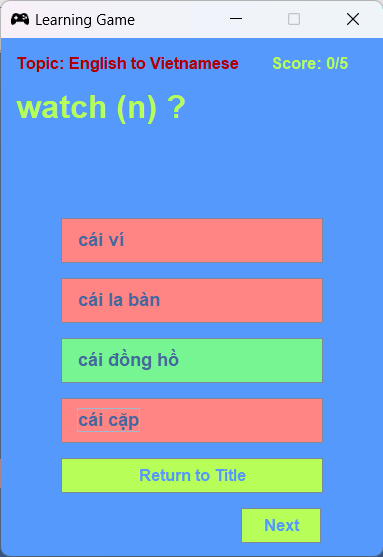\
Ngoài ra, người dùng có thể tạo câu hỏi cho riêng mình bằng nút "Create a Question" và có thể chọn đáp án đúng cho câu hỏi đó.\
Sau đó sẽ có giao diện cho người dùng thao tác.\
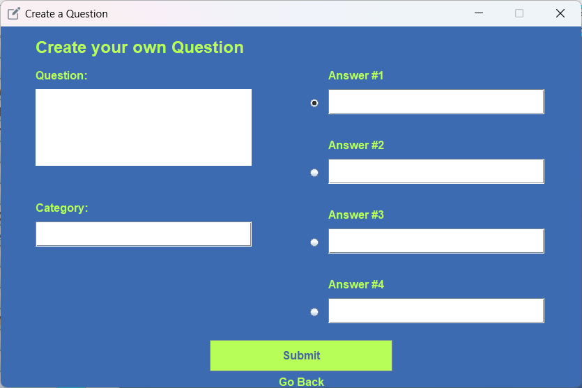

## Sơ đồ khối của toàn bộ project
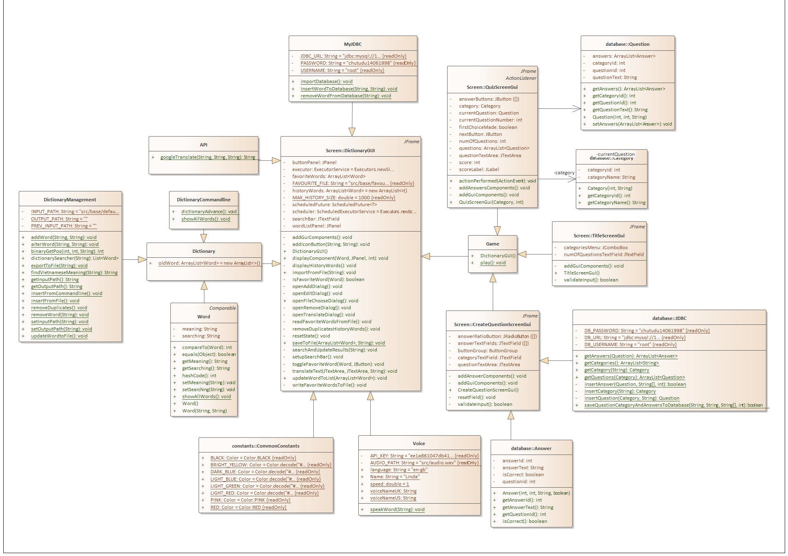
